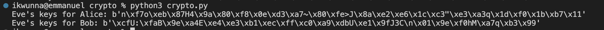

# Week 6: Diffie-Hellman-Merkle

### Task 1: Naive DH and MitM

Diffie-Hellman key exchange can be considered a cornerstone of modern public-key cryptography, enabling parties to establish a shared secret over an insecure channel. However, without proper authentication, it's vulnerable to man-in-the-middle (MitM) attacks.

**Task 1.1: Implement MitM Attack**

Implement a scenario where Alice and Bob attempt to establish a key exchange, but Eve intercepts and modifies their messages to establish two distinct exchanges with each of them. This demonstrates how Eve can decrypt and proxy messages without detection.

- Implementation Overview

1. **Alice and Bob** initiate a DH key exchange.
2. **Eve** intercepts the exchange, establishing separate key exchanges with Alice and Bob.
3. Eve decrypts, potentially modifies, and forwards messages, remaining undetected.

- Python Simulation

Below is a simplified script to demonstrate the MitM attack on the DH exchange:

```python
from Crypto.Util.number import getPrime, GCD
from Crypto.Random import get_random_bytes
import hashlib

def generate_safe_prime(bits):
    q = getPrime(bits - 1)
    p = 2*q + 1
    return p, q

def mitm_attack(p, g):
    # Simulating private key generation and interception by Eve
    a_private, b_private = get_random_bytes(16), get_random_bytes(16)
    e_a_private, e_b_private = get_random_bytes(16), get_random_bytes(16)
    
    # Alice's and Bob's public keys are intercepted and replaced by Eve's
    A, B = pow(g, int.from_bytes(a_private, 'big'), p), pow(g, int.from_bytes(b_private, 'big'), p)
    E_A, E_B = pow(g, int.from_bytes(e_a_private, 'big'), p), pow(g, int.from_bytes(e_b_private, 'big'), p)
    
    # Eve establishes shared secrets with Alice and Bob
    s_e_a, s_e_b = pow(B, int.from_bytes(e_a_private, 'big'), p), pow(A, int.from_bytes(e_b_private, 'big'), p)
    key_e_a, key_e_b = hashlib.sha256(str(s_e_a).encode()).digest(), hashlib.sha256(str(s_e_b).encode()).digest()
    
    return key_e_a, key_e_b

# Parameters and execution
g, bits = 2, 2048
p, _ = generate_safe_prime(bits)
key_e_a, key_e_b = mitm_attack(p, g)
print("Eve's keys for Alice:", key_e_a)
print("Eve's keys for Bob:", key_e_b)
```



**Task 1.2: Selection of \(g\) and \(p\) in DH Key Exchange**

The security of the Diffie-Hellman key exchange depends significantly on the choice of the generator \(g\) and the prime modulus \(p\). A safe prime \(p = 2q + 1\), where \(q\) is also prime, is ideal because it ensures a large subgroup order, reducing the susceptibility to discrete logarithm attacks. The choice of \(g\) affects the efficiency and security of the protocol. \(g\) should be chosen so that it generates a large subgroup of order \(q\) within Z(p).

Poor selection of these parameters can lead to vulnerabilities. For instance, if \(p\) is not a safe prime, the protocol may be vulnerable to subgroup attacks. Similarly, a small \(g\) or \(p\) can make the protocol susceptible to brute-force attacks.

**Task 1.3: Modern Solutions to MitM Problems in Systems like TLS**

Modern cryptographic protocols, such as TLS, address the Man-in-the-Middle (MitM) vulnerability by incorporating authentication mechanisms alongside key exchange protocols. These mechanisms can include:

1. **Certificate Authorities (CAs)**: TLS uses certificates issued by trusted Certificate Authorities to verify the identity of the parties. This ensures that the public key belongs to the entity it claims to be from, preventing an attacker from inserting their key into the exchange.
  
2. **Public Key Infrastructure (PKI)**: PKI provides a framework for managing public keys and certificates, ensuring secure communication over the internet. It includes issuing, renewing, and revoking certificates.

3. **Perfect Forward Secrecy (PFS)**: PFS ensures that even if long-term keys are compromised, past communications cannot be decrypted. This is achieved by using ephemeral key pairs for each session, which are not stored long-term.

By integrating these and other security measures, modern systems significantly reduce the risk of MitM attacks, ensuring secure communications even over public and potentially insecure channels.

------

### Task 2: DH with a very unsafe prime

2.1 Order of Alice's Share

The order is the smallest \(d\) for which \(A^d \equiv 1 \mod p\).  A straightforward approach to find (d) is a brute-force search from 1 up to p−1, but this can be optimized with knowledge of group theory or using algorithms designed for such purposes.

````py
# Function to read a value from a file
def read_value_from_file(file_path):
    with open(file_path, 'r') as file:
        return int(file.read().strip())

# Replace these paths with the actual paths to your files
prime = './unsafe_p.txt'
generator = './generator.txt'
public share = './unsafe_ga.txt'

def find_order(public_share, generator, prime):
    d = 1
    while True:
        # Alice's share^d mod p
        result = pow(public_share, d, prime)
        if result == 1:
            return d
        d += 1

# Order of Alice's share
order = find_order(public_share, generator, prime)
print("Order:", order)
````

-----
### Task 3: ElGamal & Malleability

**3.1: Exploiting ElGamal's Malleability**

ElGamal encryption is known for its malleability property, which means that given an encrypted message, it's possible to modify it into another valid encrypted message without decrypting it. Specifically, if you have an encrypted message c = (g^k, m . h^k) where m is the message, h is the recipient's public key, and g^k is a random ephemeral key, you can create a new ciphertext c^1 = (g^k, m^1 . h^k) that will decrypt to a different message m^1 without needing the private key.

This property can be exploited to alter the encrypted financial figures in your scenario. By multiplying the (y) part of the ciphertext by an appropriate factor (which corresponds to the public key raised to a power that represents the desired modification), you can adjust the encrypted figures so that they decrypt to the correct values.

**3.2: Preventing Malleability**

To combat malleability in ElGamal encryption, one could:

1. **Implement Authentication Mechanisms:** Implement digital signatures or Message Authentication Codes (MACs) alongside the encrypted message to ensure the integrity and authenticity of the message. Any modification to the ciphertext would invalidate the signature or MAC, alerting the recipient to the tampering.

2. **Use Cryptographic Hash Functions:** Combining the ciphertext with a hash of the plaintext before encryption can also prevent malleability. The recipient can decrypt the message, recompute the hash of the plaintext, and compare it to the decrypted hash to verify integrity.


