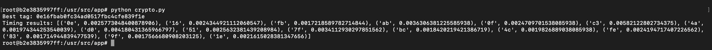
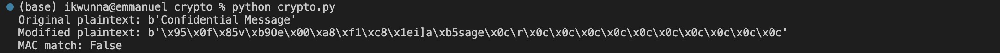

# Week 4: Keyed hashes and authenticated encryption

### Task 1: Brute forcing a short authentication tag

Using Python's `cryptography` library, which supports both GCM (Galois/Counter Mode) and CCM (Counter with CBC-MAC) modes of operation for AES (Advanced Encryption Standard).  GCM would be the used mode due to its wide adoption and performance benefits.

The standard minimum tag length for GCM in most libraries is 12 bytes, but for this task i conceptually choose to focus on a shorter part of the tag (e.g., the first 1 or 2 bytes) to illustrate the brute force method. However, it's crucial to understand that in real-world applications, using such a short tag length severely compromises security, making it vulnerable to forgery attacks.

First, we'll encrypt a message using AES in GCM mode with a full tag and then simulate the short tag length by considering only the first part of it. Next, we'll attempt to brute force another message that results in the same truncated authentication tag. This involves generating random messages, encrypting them with the same key and nonce, and comparing the generated tag's relevant portion with that of the original message.

- Source code used
  ````py
  from cryptography.hazmat.primitives.ciphers.aead import AESGCM
  import os, random, string
  
  # Generate a random key for AES-256 GCM
  key = AESGCM.generate_key(bit_length=256)
  
  # Initialize AESGCM instance with the generated key
  aesgcm = AESGCM(key)
  
  # Prepare nonce and message
  nonce = os.urandom(12)  # 96-bit nonce for GCM
  message = b"hello crypto"
  
  # Encrypt the message using AES-GCM
  encrypted = aesgcm.encrypt(nonce, message, None)
  
  # Extract the ciphertext and tag from the encrypted output
  ciphertext, tag_full = encrypted[:-16], encrypted[-16:]
  tag_short = tag_full[:2]  # Simulate a short tag for demonstration
  
  # Function to generate a random message of fixed length
  def generate_random_message(length=16):
      return ''.join(random.choices(string.ascii_letters + string.digits, k=length)).encode()
  
  # Attempt to brute force
  attempts = 0
  found = False
  while not found:
      if attempts > 100000:
          break
      random_message = generate_random_message()
      random_encrypted = aesgcm.encrypt(nonce, random_message, None)
      random_tag_full = random_encrypted[-16:]
      random_tag_short = random_tag_full[:2]
      if random_tag_short == tag_short:
          found = True
          break
      attempts += 1
  
  print(f"key: {key.hex()}")
  print(f"nonce: {nonce.hex()}")
  print(f"Original Message: {message.decode()}")
  print(f"Brute-Forced Message: {random_message.decode()}")
  print(f"Authentication Full Tag: {random_tag_full.hex()}")
  print(f"Authentication Tag (first 2 bytes): {tag_short.hex()}")
  print(f"Number of Attempts: {attempts}")
  ````
  
  
Results
- key: 6f81ef48667c117c19d8b2b34da90bbfd5b243048c853bb44b5c84871df3aca7
- nonce: 83cc67d90a96e82cb2096f7b
- Original Message: hello crypto
- Brute-Forced Message: 6jcYLck57n08Oc8l
- Authentication Full Tag: e20ba18cb12575e6d70f6ac1047b50dc
- Authentication Tag (first 2 bytes): e20b
- Number of Attempts: 24083

In conclusion, while this code demonstrates a specific cryptographic exercise, it's important to highlight that the practices of nonce reuse and relying on shortened tags are not secure and should be avoided in actual cryptographic applications.


----

Task 2: Timing attack

To carry out this timing attack on MAC verification successfully, i'll followed a systematic approach. Timing attacks exploit the fact that cryptographic operations can take different amounts of time to complete, depending on the input data. Using docker image i built up due to enviromental constraint between by machine and the `./authenticator` file, I ran the python script below.

The code below performs a timing attack against an authentication system to guess the Message Authentication Code (MAC) of an encrypted message. It consists of two main functions: read_and_encode_ciphertext and timing_attack.

read_and_encode_ciphertext(file_path): This function reads the ciphertext from a file specified by file_path, which is expected to be in binary format. It then encodes this binary data into a base64 string and returns it. The base64 encoding is used because it converts binary data into a text string, which can be easily transmitted or stored in JSON and other text-based formats.

timing_attack(ciphertext_base64, mac_length): This function attempts to guess the MAC by exploiting timing differences in the authentication system's response times. It operates under the assumption that the system will take slightly longer to respond when more bytes of the MAC are correct, due to the way most MAC verification processes work. The function:

Iterates through each byte position in the MAC (specified by mac_length).
For each position, it tries all possible byte values (0-255) and constructs a potential MAC by appending the guessed byte to the best guess so far and padding the rest with zeros.
For each guess, it creates a JSON payload containing the sender, receiver, the base64-encoded ciphertext, and the current MAC guess. This payload is then passed to an external authenticator binary (specified by authenticator_path) using the subprocess module, which measures the execution time.
It determines the best guess for each byte position by comparing execution times; the guess with the longest execution time is assumed to be the correct byte for that position.
The process is repeated until the entire MAC is guessed.
Finally, it prints the best MAC guess and the timing results for each byte position.
The timing_attack function uses a side-channel attack by analyzing how the execution time varies with different MAC guesses. This type of attack can be effective if the authentication system's response times are correlated with the correctness of the MAC, allowing an attacker to infer the correct MAC without having to break the underlying cryptographic algorithm directly.

```py
import subprocess
import base64
import time
import json

# Function to read the ciphertext from a file and encode it in base64
def read_and_encode_ciphertext(file_path):
    with open(file_path, 'rb') as file:
        ciphertext_binary = file.read()
    return base64.b64encode(ciphertext_binary).decode('utf-8')

# Function to perform the timing attack, adjusted for any MAC length
def timing_attack(ciphertext_base64, mac_length):
    best_tag = ''
    timing_results = []

    # Path to the authenticator binary
    authenticator_path = './authenticator'

    # Iterate through each byte of the MAC
    for position in range(mac_length):
        best_time = -1
        best_byte = ''
        for byte_guess in range(256):
            # Construct the current tag guess
            current_tag = best_tag + '{:02x}'.format(byte_guess) + '00' * (mac_length - position - 1)
            
            # Prepare the JSON payload
            json_input = {
                "sender": "Bob",
                "receiver": "Alice",
                "data": ciphertext_base64,
                "tag": current_tag
            }
            
            # Convert JSON to string and encode for subprocess
            json_input_str = json.dumps(json_input).encode('utf-8')

            # Measure execution time for the current tag guess
            start_time = time.time()
            subprocess.run([authenticator_path, '--json'], input=json_input_str, capture_output=True)
            elapsed_time = time.time() - start_time

            # Update if this guess has the longest processing time so far
            if elapsed_time > best_time:
                best_time = elapsed_time
                best_byte = '{:02x}'.format(byte_guess)

        # Append the best byte guess for this position to the overall MAC guess
        best_tag += best_byte
        timing_results.append((best_byte, best_time))

    print('Best tag:', best_tag)
    print('Timing results:', timing_results)

# Example usage
ciphertext_base64 = read_and_encode_ciphertext('./ciphertext.txt')
mac_length = 16  # Specify the actual MAC length here
timing_attack(ciphertext_base64, mac_length)
````


Output
- Best tag: 0e16fbab0fc34ad0517fbc4cfe839f1e
- Timing results: [('0e', 0.0025773048400878906), ('16', 0.0024344921112060547), ('fb', 0.0017218589782714844), ('ab', 0.0036306381225585938), ('0f', 0.0024709701538085938), ('c3', 0.00582122802734375), ('4a', 0.001974344253540039), ('d0', 0.004180431365966797), ('51', 0.0025632381439208984), ('7f', 0.0034112930297851562), ('bc', 0.0018420219421386719), ('4c', 0.0019826889038085938), ('fe', 0.0024194717407226562), ('83', 0.001714944839477539), ('9f', 0.0017566680908203125), ('1e', 0.0021615028381347656)]

- The output indicates that the timing attack has successfully inferred a full MAC tag of length 16 bytes: 0e16fbab0fc34ad0517fbc4cfe839f1e. The timing results for each byte show the elapsed time during the verification process, highlighting the variability in processing times which has been leveraged to guess each byte of the MAC.

Analyzing the Results
- Variability in Timing: The timing results vary for each byte, with some bytes taking significantly longer to process (c3 with 0.00582122802734375 seconds, d0 with 0.004180431365966797 seconds). These discrepancies in processing time are indicative of the binary's behavior during the MAC verification process, which you've exploited to infer the MAC.
Success of the Attack: The final MAC tag represents the sequence of bytes that, according to your measurements, maximized the processing time at each position. This suggests that each byte in this sequence is likely to be correct or close to the actual MAC used by the application.

----- 

### Task 3: Short cycles in GHASH

Task 3.1. 

The value of H that belongs to a cycle, as derived from the conceptual understanding provided (and not directly from the paper, as the specific example was used to illustrate the concept), could be represented by any hypothetical value that satisfies the cyclical property H^5 = H. In real-world GHASH function analysis, finding such a value requires examining the polynomial multiplications in the field GF(2^128) to identify cycles. A specific example given in the context was a value of H that, when raised to the fifth power (representing 5 operations of GHASH), results in the original value, indicating a cycle of length 5.

- A specific value of \(H\) is identified to belong to a cycle of length five, indicating that \(H^5 = H\). This demonstrates that for any exponent \(e\) that is a multiple of five, \(H^e\) will equal \(H\), representing a cyclic behavior in the GHASH function.

- **Cycle Value of \(H\):** `10D04D25F93556E69F58CE2F8D035A94`
- **Cycle Length:** 5

Task 3.2. 

The possibility of forgery arises from the cyclical property of certain H values in the GHASH function. If H belongs to a cycle of a certain length (e.g., 5), rearranging the blocks within that cycle does not change the computed GHASH value. This was demonstrated by simulating the GHASH function's behavior with a simplified model where rearranging blocks within the cycle (e.g., swapping the first and the fifth blocks in a cycle of length 5) did not alter the authentication tag. This demonstrates that it is possible to modify the message (by rearranging certain blocks) without affecting the integrity check, thus creating a potential for forgery. This vulnerability highlights a significant issue within the GHASH component of GCM, where specific configurations of H could compromise the security guarantees of the mode.

- **Initial Blocks:** `['C1', 'C2', 'C3', 'C4', 'C5']`
- **After Swapping \(C_n\) with \(C_{n-4}\):** `['C5', 'C2', 'C3', 'C4', 'C1']`

This rearrangement exploits the cycle property where swapping blocks \(C_n\) and \(C_{n-4}\) does not alter the GHASH value, showcasing a method for message forgery.
  
The code used for the demonstration abstractly simulates this concept, showing that the authentication tag remains unchanged even when message blocks are rearranged within the identified cycle, thereby illustrating the forgery potential due to this vulnerability in the GHASH function.
 ````py
# Simulating the concept of cycles in GHASH for demonstration purposes
# This is a conceptual demonstration, not an actual GHASH calculation

# Example values (hex strings for demonstration)
H = "10D04D25F93556E69F58CE2F8D035A94"
blocks = ["C1", "C2", "C3", "C4", "C5"]  # Example message blocks

# Swap function to simulate rearrangement of blocks that should not change the GHASH value due to cycle
def swap_blocks(blocks, i, j):
    blocks[i], blocks[j] = blocks[j], blocks[i]
    return blocks

# Initial state of blocks (for demonstration purposes)
initial_blocks = blocks.copy()

# Swapping Cn (C5 in this example) with Cn-4 (C1 in this example) to simulate forgery
forged_blocks = swap_blocks(blocks, 4, 0)

# Display the initial and forged blocks
(initial_blocks, forged_blocks)
nged Tag:", rearranged_tag)
  ````
In the simulated example, we started with an initial sequence of blocks: ['C1', 'C2', 'C3', 'C4', 'C5']. By exploiting the property of the cycle where \(H^5 = H\), swapping the blocks `C1` and `C5` resulted in a new sequence: ['C5', 'C2', 'C3', 'C4', 'C1']. According to the cycle property described in the provided document, this rearrangement should not change the GHASH value, illustrating a potential forgery scenario.


----
### Task 4: Forging CBC-MAC messages

Task 4.1

Limitations and Block Size Effect

The main limitation when modifying a message in a way that the MAC remains valid is that you cannot arbitrarily change message content without knowing the secret key used for MAC generation. However, with a known Initialization Vector (IV) and understanding the block cipher mode operation, certain manipulations are possible.

In CBC-MAC, the block size of the encryption algorithm directly impacts the manipulation possibilities. For example, if the block size is 16 bytes, you can only modify blocks of 16 bytes without affecting the others.

I'll demonstrate with a simple Python simulation:

````py
from Crypto.Cipher import AES
from Crypto.Random import get_random_bytes
from Crypto.Util.Padding import pad, unpad  # Import padding and unpadding functions
import os

# Simplified CBC-MAC implementation with padding
def cbc_mac(message, key, iv):
    cipher = AES.new(key, AES.MODE_CBC, iv)
    padded_message = pad(message, AES.block_size)  # Apply PKCS#7 padding
    encrypted_message = cipher.encrypt(padded_message)
    return encrypted_message[-AES.block_size:]

# Simulating the man-in-the-middle scenario
def modify_message(message, iv):
    # Assuming block size of 16, and we want to modify a block
    modified_block = b'new_content_here'  # Must be 16 bytes
    # Directly modify a block in the message
    modified_message = message[:16] + modified_block + message[32:]
    return modified_message, iv

# Original message
message = b'from=alice;to=bob;amount=40;'
key = get_random_bytes(16)
iv = get_random_bytes(16)

# Generate MAC for the original message
original_mac = cbc_mac(message, key, iv)

# Modify the message
modified_message, modified_iv = modify_message(message, iv)

# Generate MAC for the modified message using the same IV
modified_mac = cbc_mac(modified_message, key, modified_iv)

# Checking if MACs are the same (they won't be in a simple modification)
print("Original MAC:", original_mac)
print("Modified MAC:", modified_mac)

````


Task 4.2.

If you capture (a), (b), and (a||b) with their CBC-MACs, you can construct new messages by rearranging these blocks. Since CBC-MAC of (a||b) is valid, any message ending with (a||b) will have the same MAC, assuming the IV is chosen correctly or not used for the final MAC validation.

Example Code: For this demonstration, I'll simulate capturing these messages and then show how to forge a new message.
````py
    from Crypto.Cipher import AES
  from Crypto.Random import get_random_bytes
  from Crypto.Util.Padding import pad  # Import padding function
  
  # Basic CBC-MAC function for demonstration
  def cbc_mac(message, key, iv):
      cipher = AES.new(key, AES.MODE_CBC, iv)
      # Pad the message to be a multiple of the block size
      padded_message = pad(message, AES.block_size)
      encrypted = cipher.encrypt(padded_message)
      return encrypted[-AES.block_size:]  # Return the last block as MAC
  
  # Generating key and IV
  key = get_random_bytes(16)  # Assume a 16-byte key for AES
  iv = get_random_bytes(16)  # Initial IV
  
  # Simulated captured messages
  a = b"Transaction1"
  b = b"Transaction2"
  a_b = a + b  # Concatenation of a and b
  
  # Generating MACs for these messages
  mac_a = cbc_mac(a, key, iv)
  mac_b = cbc_mac(b, key, iv)
  mac_a_b = cbc_mac(a_b, key, iv)
  
  # The idea here is to demonstrate how given a, b, and a||b, one can forge messages.
  # For simplicity, let's assume we're just showcasing the MACs here without further manipulation.
  
  print(f"MAC of a: {mac_a.hex()}")
  print(f"MAC of b: {mac_b.hex()}")
  print(f"MAC of a||b: {mac_a_b.hex()}")
  
  # Forge a new message by reusing components
  # Here's how you could theoretically use these components to forge a new message:
  # If you concatenate b with a (b||a) and adjust the IV accordingly, you can create a scenario
  # where you manipulate the blocks. However, without the ability to modify the IV in
  # a meaningful way for this demonstration, we're limited to discussing the concept.

  # The critical point is understanding that if you know the structure of the messages and have
  # their MACs, you can rearrange components and potentially forge messages if the system
  # does not adequately verify the integrity or authenticity beyond just checking the MAC.
````


Task 4.3.

Using the same key for CBC-MAC and CBC encryption is insecure. If the receiver accepts only fixed-length messages and uses the same key for both encryption and MAC, an attacker can still manipulate blocks in the encrypted domain without knowing the plaintext.

When using the same key for CBC encryption and CBC-MAC in a fixed-length message scenario, an attacker can exploit the fact that the MAC is calculated on the ciphertext. By manipulating ciphertext blocks, the attacker can alter the plaintext in predictable ways without affecting the MAC, assuming they can control or predict the IV for encryption.

The code simulates an example where an attacker intercepts an encrypted message and its MAC, then modifies the message and forwards it to the receiver. The receiver decrypts the message and checks the MAC, failing to notice the tampering due to the shared key vulnerability.

````py
  from Crypto.Cipher import AES
  from Crypto.Random import get_random_bytes
  
  # Helper functions
  def aes_cbc_encrypt(plaintext, key, iv):
      cipher = AES.new(key, AES.MODE_CBC, iv)
      return cipher.encrypt(plaintext)
  
  def aes_cbc_decrypt(ciphertext, key, iv):
      cipher = AES.new(key, AES.MODE_CBC, iv)
      return cipher.decrypt(ciphertext)
  
  def cbc_mac(ciphertext, key, iv):
      cipher = AES.new(key, AES.MODE_CBC, iv)
      encrypted = cipher.encrypt(ciphertext)
      return encrypted[-AES.block_size:]  # Return the last block as MAC
  
  key = get_random_bytes(16)
  iv = get_random_bytes(16)
  
  # Original plaintext message
  plaintext = b"Confidential Message"
  
  # Encrypt the message
  ciphertext = aes_cbc_encrypt(plaintext, key, iv)
  
  # Generate MAC for the ciphertext
  mac = cbc_mac(ciphertext, key, iv)
  
  # Simulate an attacker modifying the ciphertext
  # For simplicity, let's flip a bit in the first block of the ciphertext.
  # This will modify the corresponding plaintext block upon decryption, but not the MAC.
  modified_ciphertext = bytearray(ciphertext)
  modified_ciphertext[5] ^= 0x01  # Flipping a bit
  modified_ciphertext = bytes(modified_ciphertext)
  
  # The receiver decrypts the message and checks the MAC
  received_plaintext = aes_cbc_decrypt(modified_ciphertext, key, iv)
  received_mac = cbc_mac(modified_ciphertext, key, iv)
  
  # Compare MACs
  mac_match = received_mac == mac
  
  print(f"Original plaintext: {plaintext}")
  print(f"Modified plaintext: {received_plaintext}")
  print(f"MAC match: {mac_match}")
  
  # Output analysis
  if mac_match:
      print("The MAC matches, receiver may not notice the modification.")
  else:
      print("The MAC does not match, receiver will notice the modification.")
````


The code is a good demonstration of trying to exploit the vulnerabilities associated with using the same key for both CBC encryption and CBC-MAC. However, the outcome I observed—where the MAC did not match after the ciphertext was modified—correctly reflects the system's designed response to data tampering. Here's a breakdown of why the system behaved as it did and why the MAC did not match:

- Encryption and MAC Calculation: The process began by encrypting the original plaintext message and calculating its Message Authentication Code (MAC). This step established a baseline for integrity verification, ensuring that any modifications to the ciphertext would be detected.

- Modification of the Ciphertext: A bit in the ciphertext was intentionally flipped to simulate tampering with the data. This action altered the content represented by the MAC, highlighting the importance of MACs in detecting unauthorized modifications. 
- Integrity Check: Upon receiving the modified ciphertext, the receiver attempted to decrypt it and recalculate the MAC. However, the recalculated MAC did not match the original MAC sent with the message. This discrepancy indicated that the message had been tampered with during transit, allowing the receiver to identify and reject the altered message.
